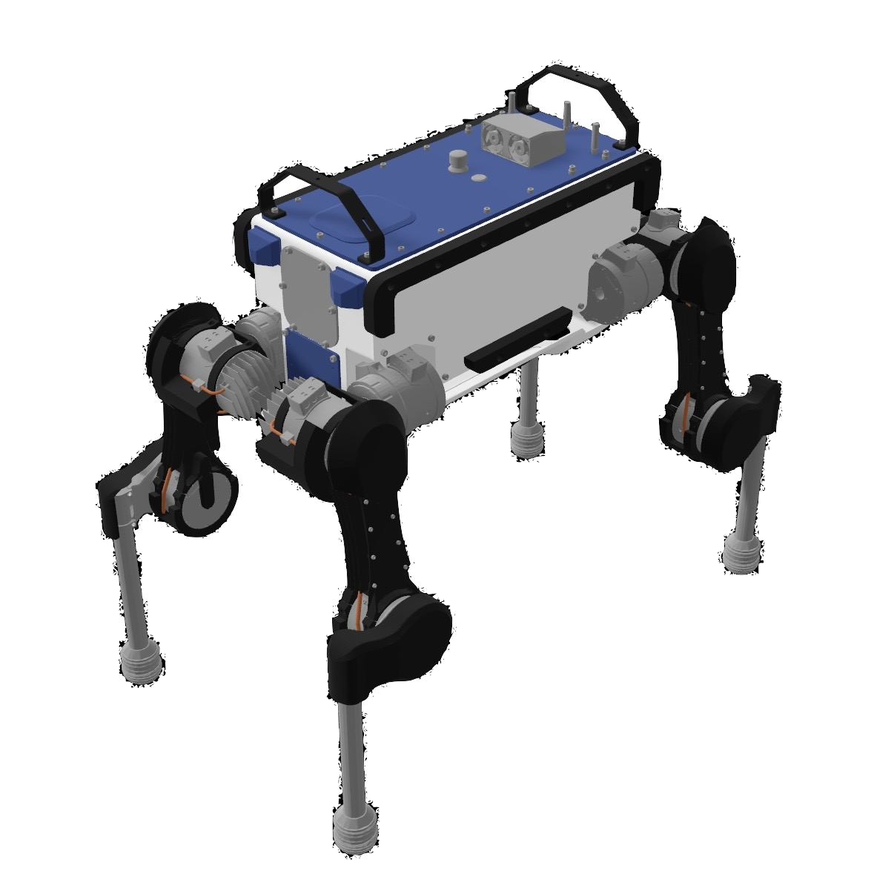
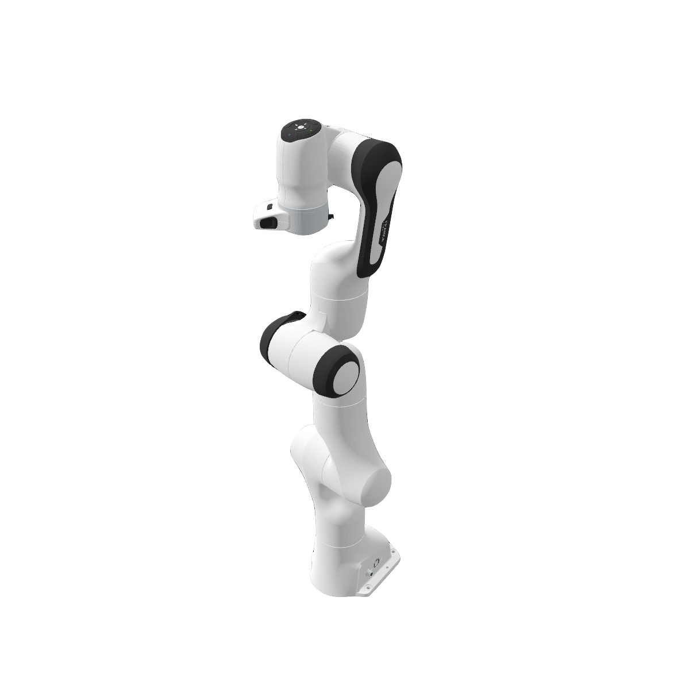
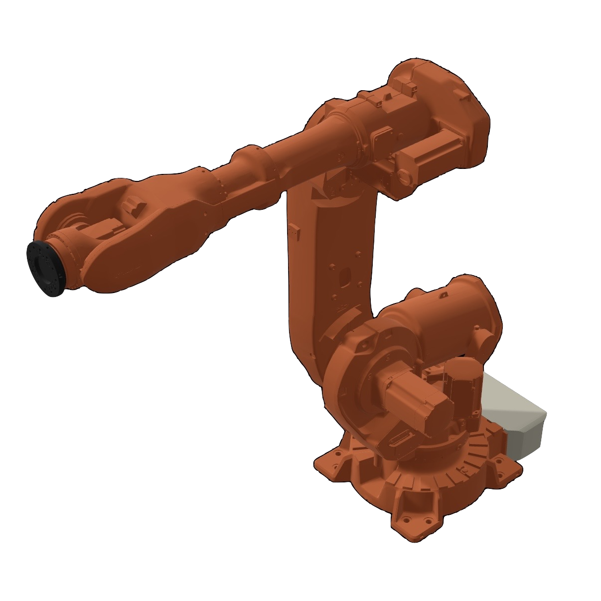

# DAE-to-RealityKit
Extensions to convert 3D models in DAE (COLLADA) format to RealityKit entities, and to export RealityKit entities back to DAE.
This repository is developed as part of the [Augmented Reality Mobile Robotics (ARMOR) project](https://armor.dc-engineer.com).
Below are examples of Universal Robot Description Format (URDF) files containing DAE models, which have been loaded using this utility, and rendered in ARMOR.

| Anymal | Panda | ABB IRB 6640 |
|---|---|---|
|  |  |  |

## Loading

Both loading methods are `async throws` — they return a non-optional `ModelEntity` on success and throw a `DAEImportError` on failure.

Load from a `URL`:
```swift
let entity: ModelEntity = try await ModelEntity.fromDAEAsset(url: url)
```

Load from a `Data` object:
```swift
let entity: ModelEntity = try await ModelEntity.fromDAEAsset(data: data)
```

An optional `DAEImportOptions` parameter controls which parser is used. The default `.auto` loader inspects the data to choose between the custom COLLADA parser and SceneKit, with automatic fallback if the first attempt fails. Pass `.custom` or `.sceneKit` to force a specific parser:
```swift
let entity: ModelEntity = try await ModelEntity.fromDAEAsset(url: url, options: .init(loader: .custom))
```

### Remote Streaming

When a remote `http(s)://` URL is passed with the `.custom` loader, the parser automatically resolves relative texture paths declared in `<library_images>` to sibling URLs under the same remote base path. Each texture is fetched asynchronously via `URLSession` and applied to the entity's `PhysicallyBasedMaterial` as a `TextureResource`. If a texture fetch fails, the material falls back gracefully to the flat diffuse color.

```swift
let remoteURL = URL(string: "https://example.com/models/robot/robot.dae")!
// Textures like "RobotTexture.png" resolve to https://example.com/models/robot/RobotTexture.png
let entity = try await ModelEntity.fromDAEAsset(url: remoteURL, options: .init(loader: .custom))
```

### Texture Resolution

When loading with the custom parser, the full COLLADA texture pipeline is resolved:

`<texture>` → `<sampler2D>` → `<surface>` → `<init_from>` → file path

The resolved path is then converted to an absolute URL relative to the source DAE:
- **Local source** (`file://`) — texture is loaded from the same directory as the DAE file using `TextureResource(contentsOf:)`.
- **Remote source** (`http(s)://`) — texture URL is constructed by appending the relative path to the DAE's base URL, then fetched over the network.
- **No source URL** (data-only load) — texture loading is skipped and the flat diffuse color is used.

## Exporting

A `ModelEntity` hierarchy can be serialized back to a COLLADA 1.4.1 XML file:

```swift
try await entity.writeDAEAsset(to: url)
```

The exporter walks the entity tree, extracts mesh geometry (positions, normals, and UV coordinates where present), and writes a valid COLLADA document. Throws `DAEWriteError.meshExtractionFailed` if no mesh geometry is found in the hierarchy.

## Installation

### Xcode

1. From the `File` menu, select `Add Package Dependencies`.
2. In the search bar in the upper right, enter `https://github.com/radcli14/DAE-to-RealityKit`.
3. Make sure your project is selected in the `Add to Project` line, then click the `Add Package` button in the lower right.
4. Make sure your target is selected in the `Add to Target` line, then click the `Add Package` button again.

### Swift Package Manager

Add the package to your `Package.swift` dependencies:

```swift
dependencies: [
    .package(url: "https://github.com/radcli14/DAE-to-RealityKit", from: "0.5.0")
]
```

Then add `"DAE-to-RealityKit"` to your target's dependencies:

```swift
.target(
    name: "YourTarget",
    dependencies: [
        .product(name: "DAE-to-RealityKit", package: "DAE-to-RealityKit")
    ]
)
```

Requires iOS 18+ or macOS 15+.


## Developer Guidelines
 
The directories are structured as follows:
 - **RealityKit**: Extensions on `ModelEntity` and `Entity` that allow loading from and writing to DAE-formatted XML, as in the quickstart
 - **Collada**: Data structures derived from the COLLADA 1.4.1 schema, parsed from XML using the [XMLCoder](https://github.com/MaxDesiatov/XMLCoder) package
 - **SceneKit**: Extensions on SceneKit objects to provide data that can aid in conversion to RealityKit
 
### Note Regarding SceneKit
 
The SceneKit extensions represented an early attempt to simply use the SceneKit DAE loader as an intermediate stage to obtaining the RealityKit entity. 
This worked in the case that the DAE files are provided in the bundle at compile-time, which Xcode automatically converts to scene files. 
However, that does not work for DAE files that are outside of the bundle and loaded at runtime. 
Therefore, the Collada extensions are created as a more general-purpose DAE parser.

Since SceneKit is deprecated, anticipate that the SceneKit extensions may ultimately be removed.
In this case, the directories are organized such that files in the Collada folder depend only on `XMLCoder`, while the `RealityKit` dependencies are fully contained in that folder.
