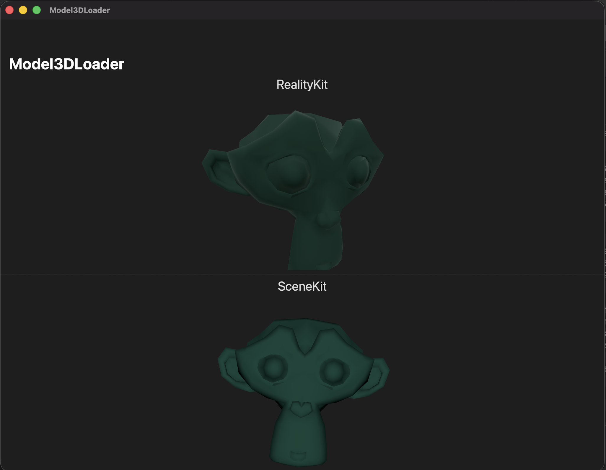

# DAE-to-RealityKit
Extensions to convert 3D models in DAE format to RealityKit entities.



These extensions allow importing of DAE models at runtime using a custom `Collada` parser.
Most of the time, you will asynchronously load an entity using the static extension methods, for example, if you have a `URL` for a DAE file location:
```swift
let entity: ModelEntity? = await ModelEntity.fromDAEAsset(url: url)
```

Alternately, if you have already loaded the file as a Swift `Data` object (i.e., `Data(contentsOf: url)`:
```swift
let entity: ModelEntity? = await ModelEntity.fromDAEAsset(data: data)
```

An optional `options` data structure may be passed to either of these, which can be used to specify whether to use the custom `Collada` parser, or using `SceneKit` as an intermediate step.
Most of the time, this argument can be omitted, in which case the code will detect which is the best to use.

 ## Developer Guidelines
 
 The directories are structured as follows:
 - **RealityKit**:: Extensions on `ModelEntity` that allow loading from DAE-formatted XML, as in the quickstart
 - **Collada**: Data structure derived from the COLLADA 1.4.1 Schema, parses from XML using the [XMLCoder](https://github.com/MaxDesiatov/XMLCoder) package
 - **SceneKit**: Extensions on SceneKit objects to provide data that can aid in conversion to RealityKit
 
 ### Note Regarding SceneKit
 
The SceneKit extensions represented an early attempt to simply use the SceneKit DAE loader as an intermediate stage to obtaining the RealityKit entity. 
This worked in the case that the DAE files are provided in the bundle at comple-time, which XCode automatically converts to scene files. 
However, that does not work for DAE files that are outside of the bundle and loaded at runtime. 
Therefore, the Collada extensions are created as a more general-purpose DAE parser.

Since SceneKit is deprecated, anticipate that the SceneKit extensions may ultimately be removed.
In this case, the directories are organized such that files in the Collada folder depend only on `XMLCoder`, while the `RealityKit` dependencies are fully contained in that folder.
